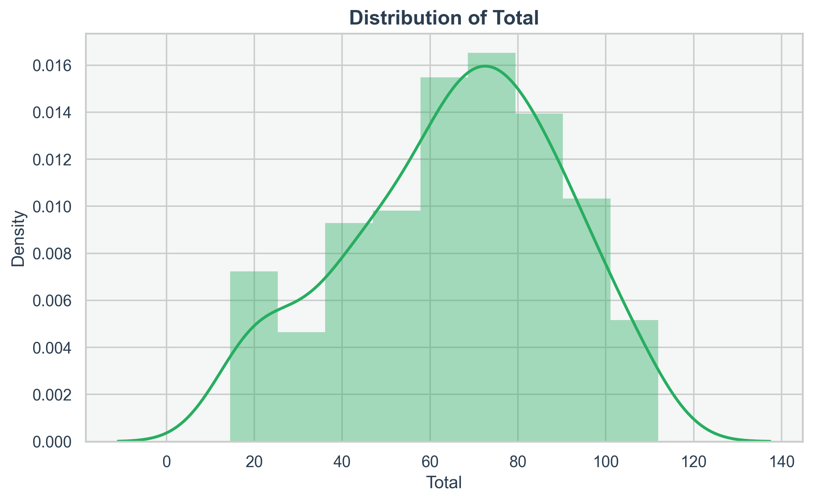
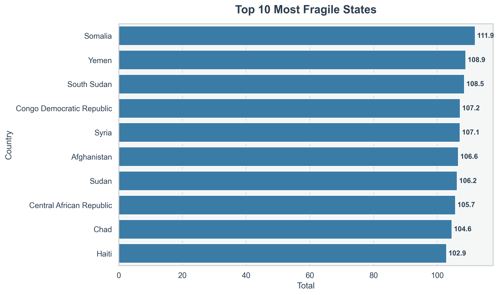
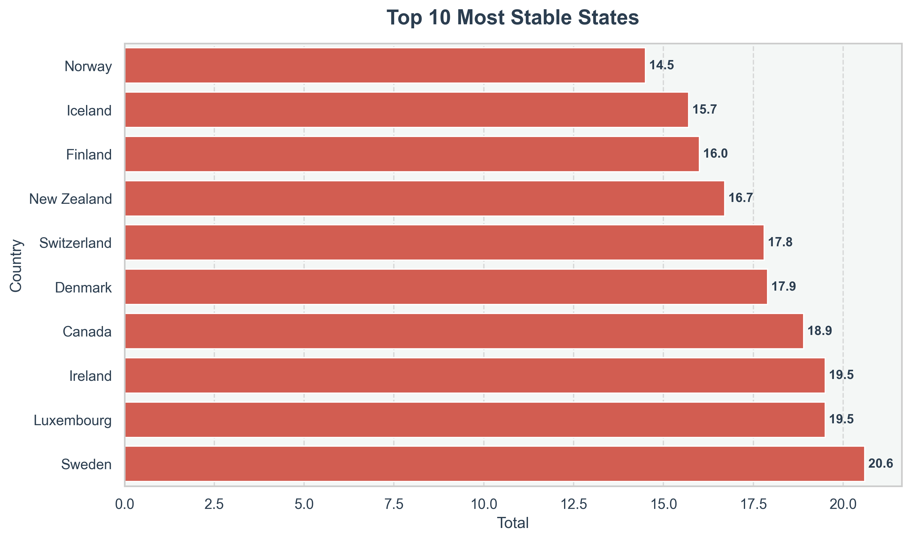
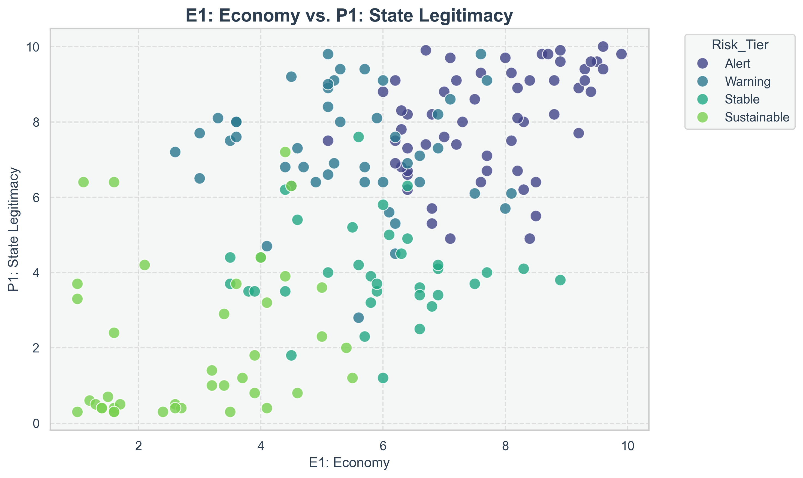
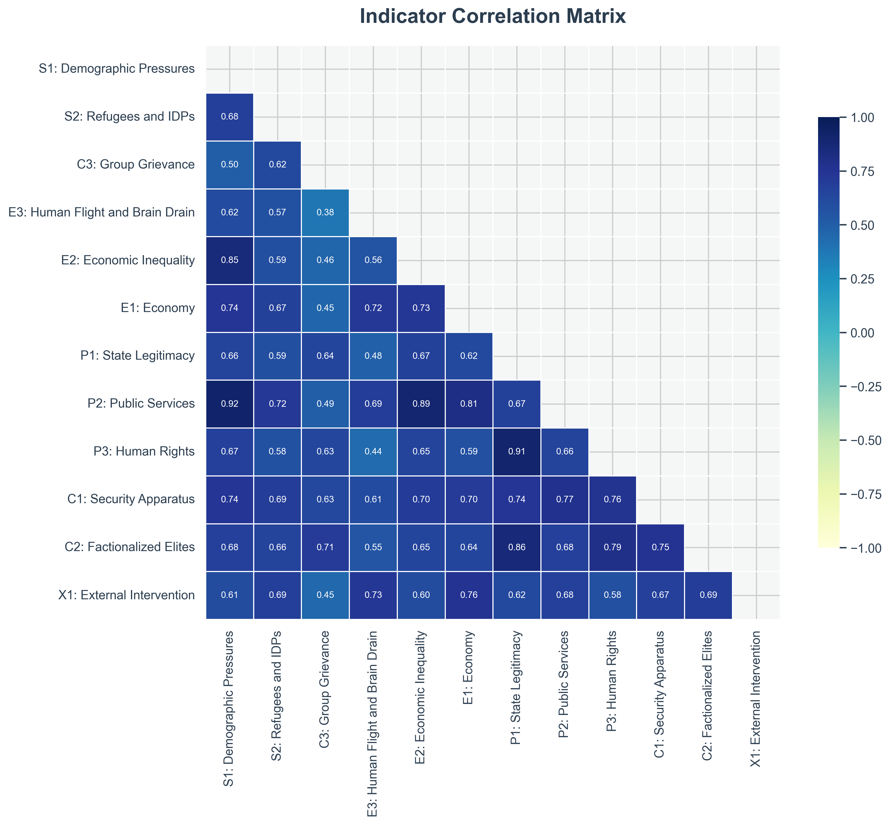

# Fragile States Analytics Pipeline

## Overview
This project is a fully automated analytics pipeline built in Python for processing, cleaning, analyzing, visualizing, and reporting on Fragile States Index datasets. The system programmatically ingests raw Excel datasets and applies a sequential workflow encompassing data engineering, statistical analysis, machine learning clustering, and automated report generation. The final outputs include styled Excel workbooks, HTML executive summaries, and PDF exports.

## Core Technology Stack
- **Python**: Core execution and logic layer.
- **Pandas & NumPy**: Data manipulation, cleaning, and mathematical operations.
- **Scikit-Learn**: Machine learning and clustering algorithms.
- **Matplotlib & Seaborn**: Statistical data visualization.
- **OpenPyXL & XlsxWriter**: Excel file generation and cell-level formatting.
- **Jinja2**: HTML templating.
- **Playwright**: Headless browser automation for PDF conversion.
- **Logging**: Native Python module for execution tracking.

## Project Features
- Automated Excel dataset ingestion and validation.
- Data cleaning pipeline including boundary validation and missing value imputation.
- Statistical analysis engine for socio-economic indicators.
- KMeans clustering integration for geopolitical risk classification.
- Automated generation of high-resolution distributions and correlation heatmaps.
- Multi-sheet Excel report generation with conditional formatting.
- HTML and PDF executive report rendering.
- Centralized logging architecture with file and console stream handlers.
- Modular codebase design separating concerns across discrete execution steps.
- Automated output directory organization.

## Architecture Overview
The system follows a modular pipeline architecture. The application is divided into dedicated modules, each handling a specific stage of the data lifecycle. The orchestration is managed by a single entry point script that controls the execution sequence and ensures data integrity between transitions.

### Automation Pipeline
The execution flow strictly follows this sequence:
1. **Raw Excel Dataset Ingestion**: Loads the unstructured source file.
2. **Data Cleaning**: Normalizes schema, handles missing fields, and enforces typing.
3. **Validation**: Ensures metric boundaries remain within expected thresholds.
4. **Statistical Analysis**: Computes variances, distributions, and summary statistics.
5. **Machine Learning Clustering**: Maps structured data to risk tiers.
6. **Visualization Generation**: Exports PNG assets for the reporting layer.
7. **Styled Excel Report Export**: Generates raw and analyzed data views.
8. **HTML Report Generation**: Compiles visualizations and KPIs into a DOM structure.
9. **PDF Conversion**: Invokes a headless browser to print the DOM to PDF.

## Directory Structure
The project relies on a standardized directory structure to organize execution outputs.

```text
fragile_states_analytics_pipeline/
├── analysis.py
├── cleaning.py
├── main.py
├── practice_data.xlsx
├── report_generator.py
├── requirements.txt
├── utils.py
├── visualization.py
└── project_output/
    ├── charts/
    ├── cleaned_data/
    ├── logs/
    └── reports/
```

## Machine Learning Workflow
The analysis module utilizes KMeans clustering to categorize countries into analytical risk groups. 

The workflow consists of:
- **Feature Selection**: Isolating the 12 core fragility indicators.
- **Data Standardization**: Applying `StandardScaler` to normalize distributions prior to distance calculations.
- **Cluster Generation**: Executing KMeans with an initialized state for deterministic output.
- **Risk Label Mapping**: Calculating cluster centroids to assign human-readable labels (e.g., Alert, Warning, Stable, Sustainable).
- **Cluster Interpretation**: Merging the assigned tiers back into the primary dataframe for downstream reporting.

## Visualization System
The visualization module uses a unified corporate theme configuration to ensure visual consistency across all assets. 

Generated assets include:
- Distribution analysis of total scores via Kernel Density Estimation (KDE).
  
- Top and bottom ranking visualizations.
  
  
- Economy versus State Legitimacy scatter plots mapped by risk tier.
  
- Correlation matrix heatmaps for indicator relationships.
  

## Reporting System
The reporting architecture generates multiple formats to serve different stakeholders:
- **Excel Outputs**: Utilizes `XlsxWriter` to apply cell borders, background colors, dynamic column widths, and inline data bars.
- **HTML Outputs**: Utilizes `Jinja2` templating to dynamically inject KPIs, tables, and linked image assets into a styled DOM.
- **PDF Exports**: Utilizes `Playwright` chromium engine to accurately render the HTML layout and execute a print-to-pdf operation.

## Logging System
A custom logging wrapper configures both `StreamHandler` and `FileHandler` interfaces. 
- Execution logs are piped to `project_output/logs/pipeline.log`.
- Log formatting includes timestamps, module names, log levels, and messages to support pipeline debugging.

## Performance Considerations
- **Modular Architecture**: Allows individual components (e.g., visualization) to be tested or executed in isolation.
- **Batch Processing**: The pipeline is designed to process the entire dataset in memory sequentially, optimizing I/O operations by minimizing disk writes until the export phases.
- **Automation Design**: Hardcoded paths and static configurations are isolated to `utils.py`, allowing the system to run headless without user intervention.

## Development Setup

### Dependencies Installation
The pipeline requires Python 3.8+ and several external libraries. Install the core dependencies via pip:

```bash
pip install -r requirements.txt
```

### PDF Generation Dependencies
For the PDF generation system to function, the Playwright headless browser binaries must be installed locally:

```bash
playwright install chromium
```

## Execution

To execute the complete automation pipeline, invoke the main orchestrator script from your terminal:

```bash
python main.py
```

## Outputs

Upon successful execution, the system will populate the `project_output/` directory with the following assets:
- **High-resolution analytical visualizations**: Available in [project_output/charts/](project_output/charts/)
- **Processed Datasets**: [Cleaned Dataset](project_output/cleaned_data/cleaned_fragile_states_2023.xlsx)
- **Analysis Workbooks**: [Statistical Breakdown](project_output/reports/analysis_results.xlsx)
- **Interactive HTML Dashboard**: [Executive Summary (HTML)](project_output/reports/executive_summary.html)
- **Static Exported Document**: [Executive Summary (PDF)](project_output/reports/executive_summary.pdf)
- **Execution Traces**: [pipeline.log](project_output/logs/pipeline.log)

## Future Improvements
- **CLI Support**: Implement `argparse` to allow dynamic input file targeting and output directory overrides.
- **YAML Config System**: Migrate hardcoded aesthetic themes and column mappings to a configuration file.
- **Interactive Dashboards**: Integrate Plotly/Dash for dynamic web reporting.
- **Docker Support**: Containerize the pipeline to isolate Playwright dependencies.
- **Database Integration**: Add SQLAlchemy support for direct read/write operations against relational databases.
- **Scheduled Automation**: Implement cron jobs or Airflow DAGs for recurring execution.
- **Unit Testing**: Implement `pytest` coverage for data validation and mathematical transformations.

## Author
Author: Mayank Raj  
GitHub: https://github.com/devempowerjs
Website: https://devempowerjs.vercel.app

## License
MIT License
